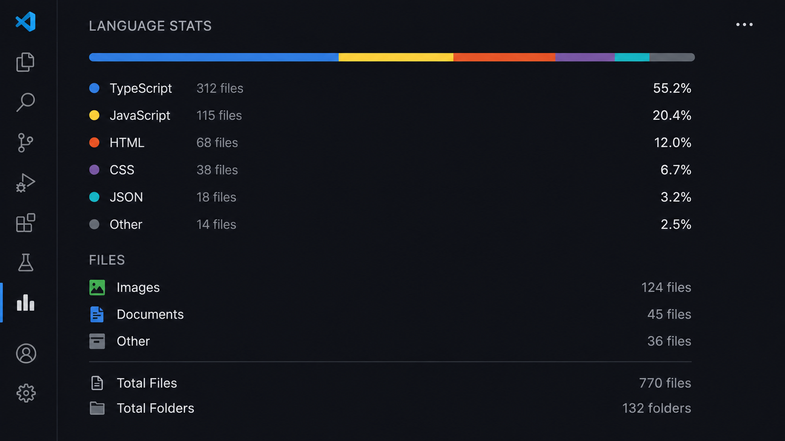

# Language Stats

Language Stats is a Visual Studio Code extension that gives you an instant, accurate picture of what your project is actually built with. It lives quietly in its own panel in the Activity Bar and shows you a clean, visual breakdown of every language, format, and file type in your workspace — without ever leaving your editor.

## Why it exists

Most developers open a project and have no real sense of its composition until they go digging file by file. Language Stats removes that guesswork. Open the panel once, and you immediately know what the project is made of — down to the percentage.

## What you get

**A weighted language breakdown.** Language Stats measures the actual size of your code, not just how many files exist. A hundred small configuration files won't outweigh the one large file that does the real work — the percentages you see reflect what's genuinely driving the project.

**A dedicated view for everything else.** Images, videos, audio, documents, fonts, archives, and compiled files are tracked separately, by count. They never distort the language percentages above them, and they're never left out of the picture either — everything in your workspace is accounted for somewhere.

**File and folder totals.** At a glance, see exactly how many files and folders make up your project, calculated from the same clean data as everything else in the panel.

**Automatic, live updates.** The panel refreshes itself the moment you add, edit, or delete a file, so what you're looking at is always current. A manual refresh is also available directly from the panel's toolbar whenever you want it.

**Noise-free by default.** Dependency folders, build output, and version control directories are excluded automatically, so what you see is your project — not the clutter around it.

## Broad language coverage

Language Stats recognizes a wide range of programming and scripting languages out of the box — including JavaScript, TypeScript, Python, Java, Kotlin, C, C++, C#, Go, Rust, PHP, Ruby, Swift, Dart, HTML, CSS, SQL, and dozens more — along with common data and configuration formats like JSON, YAML, XML, and Markdown. Anything that doesn't fall into a known category is still counted, grouped honestly under "Other," so nothing is ever silently dropped.

## Built with privacy in mind

Language Stats does its work entirely on your machine. It reads file names and sizes within your open workspace to calculate its statistics — it never reads your source code, and nothing ever leaves your editor.

## License

Released under the MIT License. See the LICENSE file for details.
